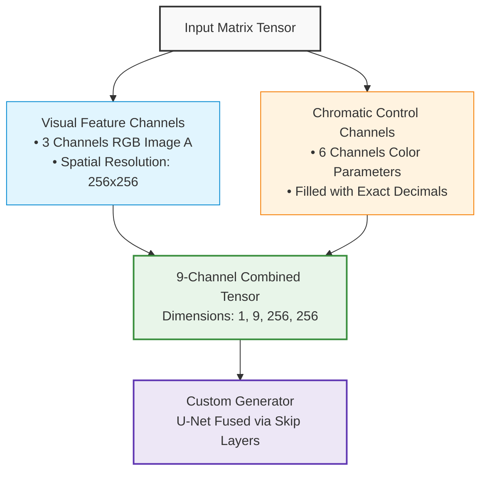

# 🎛️ Super-Conditional Pix2Pix: Professional Chromatic Control via Skip Connections

An advanced, customized implementation of the **Pix2Pix (Conditional GAN)** architecture. This repository is re-engineered to grant the user **complete manual control over image color grading and chromatic manipulation** using precise, floating-point parameters. Instead of relying solely on visual translation, the network fuses custom color constraints natively with the image channels directly inside the **U-Net Skip Connections**, leveraging the full power of AI to synthesize professional, color-accurate transformations [construct-visual-analytical-aids].

---

## 🎯 Project Vision & Core Concept

This project transforms Pix2Pix into an interactive, user-steered color-grading engine. The core mechanic relies on blending human intent with artificial intelligence:

1. **User-Driven Chromatic Parameters:** The user inputs precise floating-point values to define the desired color profile and tone mapping.
2. **Dense Tensor Integration:** The system transforms these numerical color vectors into continuous conditional matrices, matching the exact spatial dimensions of the input image (256 × 256 pixels) using strict `torch.float32` precision [construct-visual-analytical-aids, quantify-data-concrete-math].
3. **Neural Skip Connection Fusion:** Rather than injecting the color parameters only at the root layer, the 6 conditional channels flow deeply into the network. They undergo dynamic rescaling to stitch themselves directly inside the **Skip Connections (Skip Channels)**, empowering the Generator to reconstruct fine details while strictly obeying the user’s professional color tuning [construct-visual-analytical-aids].

---

## 🏗️ Neural Data Flow & Architecture

Below is the conceptual visualization of how visual features and custom chromatic constraints seamlessly merge before entering the network pipeline:



---

## 🛠️ Production-Ready Refactored Files

To support this deep-conditioning framework without dimension mismatches, the following core repository files have been fully refactored:

| File Path | Core Responsibility | Technical Implementation & Structural Fixes |
| :--- | :--- | :--- |
| 📁 `data/aligned_dataset.py` | **Data Synchronization** | Implements automated index-based mapping using `pdd.read_csv(..., header=None)`. Replaced image-name parsing with direct, fast `iloc[index]` tracking [extract-clarify-key-attributes]. Packs numerical attributes natively into a 9-channel `float32` tensor. |
| 📁 `models/pix2pix_model.py` | **Network Routing** | Expands Generator constructor routing (`netG`) to initialize with exactly **9 channels** (`opt.input_nc + 6`) [construct-visual-analytical-aids]. Expands the PatchGAN Discriminator constructor to accept **12 channels** (`opt.input_nc + opt.output_nc + 6`) to enforce color-compliance [construct-visual-analytical-aids]. |
| 📁 `models/networks.py` | **Dynamic Interpolation** | Standardizes the U-Net `unet_256` builder block to pass clean outer input dimensions to avoid channel stacking (Fixed the 15-channel mismatch error) [extract-clarify-key-attributes]. Dynamically injects bilinear resizing (`F.interpolate`) inside `UnetSkipConnectionBlock` to fuse floats natively across the downsampling chain [construct-visual-analytical-aids]. |

---

## 📁 Clean Repository Structure

This repository has been strictly pruned to keep only the customized Pix2Pix framework, freeing it from redundant scripts:

```text
pytorch-CycleGAN-and-pix2pix-master/
├── data/
│   ├── aligned_dataset.py       ➔ Fuses color parameters into a 9-channel stream
├── models/
│   ├── pix2pix_model.py         ➔ Manages 9-channel Gen and 12-channel Disc routing
│   └── networks.py              ➔ Standardizes dynamic interpolation inside Skip layers
├── datasets/
│   └── my_project_data/         ➔ Default data folder containing train_coordinates.csv
├── train.py / test.py           ➔ Main training and sequential evaluation pipelines
├── app_gradio.py                ➔ Interactive web app for local color-grading tests
└── .gitignore                   ➔ Prevents heavy training images or weights from being tracked
```

---

## 🚀 Execution & Interactive GUI

### 1. Local Dataset Preparation
Ensure your dataset paths inside `E:/` drive match the streamlined architecture perfectly:
* **Images:** `E:\pytorch-CycleGAN-and-pix2pix-master\datasets\my_project_data\train\` (contains combined wide pairs) [extract-clarify-key-attributes].
* **Coordinates:** `E:\pytorch-CycleGAN-and-pix2pix-master\datasets\my_project_data\train_coordinates.csv` [extract-clarify-key-attributes].

### 2. Local Training Execution (Windows Core)
Execute the customized training pipeline using the native Windows launcher command from your terminal:
```bash
py train.py --dataroot ./datasets/my_project_data --name my_pix2pix_model --model pix2pix --direction AtoB --no_multiprocessing
```

### 3. Launching the Interactive Color-Grading App
Once training checkpoints are saved inside `./checkpoints/my_pix2pix_model/`, fire up the independent local UI interface via localhost:
```bash
py app_gradio.py
```

---

## 📈 Future Roadmap: Spatial Attention Integration
The long-term development of this architecture includes moving from dense coordinate channel packing to a **Cross-Attention Mechanism** [construct-visual-analytical-aids]. This will map the numerical floats into a low-dimensional feature vector ($1 \times 64$) via a Multi-Layer Perceptron (MLP) [construct-visual-analytical-aids], then apply spatial attention inside the bottleneck layers to calculate localized pixel impact, reducing VRAM usage and improving micro-detail fidelity [construct-visual-analytical-aids].


