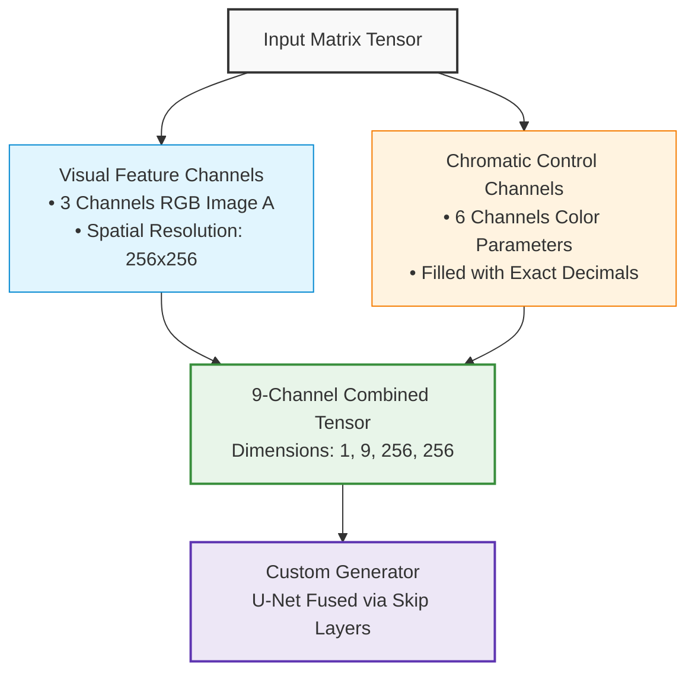

# 🎛️ Super-Conditional Pix2Pix: Professional Chromatic Control via Skip Connections


An advanced, customized implementation of the **Pix2Pix (Conditional GAN)** architecture. This repository is re-engineered to grant the user **complete manual control over image color grading and chromatic manipulation** using precise, floating-point parameters. Instead of relying solely on visual translation, the network fuses custom color constraints natively with the image channels directly inside the **U-Net Skip Connections**, leveraging the full power of AI to synthesize professional, color-accurate transformations.

---

## 🎯 Project Vision & Core Concept

This project transforms Pix2Pix into an interactive, user-steered color-grading engine. The core mechanic relies on blending human intent with artificial intelligence:

1. **User-Driven Chromatic Parameters:** The user inputs precise floating-point values to define the desired color profile and tone mapping.
2. **Dense Tensor Integration:** The system transforms these numerical color vectors into continuous conditional matrices, matching the exact spatial dimensions of the input image (256 × 256 pixels) using strict `torch.float32` precision.
3. **Neural Skip Connection Fusion:** Rather than injecting the color parameters only at the root layer, the 6 conditional channels flow deeply into the network. They undergo dynamic rescaling to stitch themselves directly inside the **Skip Connections (Skip Channels)**, empowering the Generator to reconstruct fine details while strictly obeying the user’s professional color tuning.

---

## 🏗️ Neural Data Flow & Architecture

Below is the conceptual visualization of how visual features and custom chromatic constraints seamlessly merge before entering the network pipeline:



---

## 🛠️ Production-Ready Refactored Files

To support this deep-conditioning framework without dimension mismatches, the following core repository files have been fully refactored:

| File Path | Core Responsibility | Technical Implementation |
| :--- | :--- | :--- |
| 📁 `data/aligned_dataset.py` | **Data Synchronization** | Handles fast index-based synchronization between images and the underlying color-parameter dataset matrix, packing the 9-channel tensor smoothly. |
| 📁 `models/pix2pix_model.py` | **Network Routing** | Expands the Generator input to **9 channels** (\(opt.input\_nc + 6\)) and expands the PatchGAN Discriminator to **12 channels** to enforce both visual realism and color-constraint compliance. |
| 📁 `models/networks.py` | **Dynamic Interpolation** | Embeds a dynamic bilinear resizing mechanism (`F.interpolate`) inside the `UnetSkipConnectionBlock` to automatically align the floating-point color tensors with the shrinking layers of the U-Net architecture on the fly. |

---

## 📁 Clean Repository Structure

This repository is strictly pruned to keep only the customized Pix2Pix framework, freeing it from redundant scripts:

```text
pytorch-CycleGAN-and-pix2pix-master/
├── data/
│   ├── aligned_dataset.py       ➔ Fuses color parameters into a 9-channel stream
├── models/
│   ├── pix2pix_model.py         ➔ Manages 9-channel Gen and 12-channel Disc routing
│   └── networks.py              ➔ Standardizes dynamic interpolation inside Skip layers
├── datasets/
│   └── my_project_data/         ➔ Default data folder containing train_coordinates.csv
├── train.py / test.py           ➔ Main training and sequential evaluation pipelines
├── app_gradio.py                ➔ Interactive web app for local color-grading tests
└── .gitignore                   ➔ Prevents heavy training images or weights from being tracked
```

---


